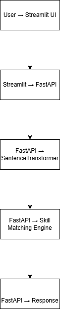

# 🧠 AI Resume Screening & RAG Evaluation System

## 🏗 System Architecture

This system evaluates candidate-job fit using:

- Semantic similarity via SentenceTransformers
- Skill gap analysis using keyword intersection
- Weighted scoring mechanism
- FastAPI backend
- Streamlit interactive frontend

- AI Resume Screening & RAG Evaluation System

A production-ready resume–job description evaluation platform built with FastAPI and Streamlit.
It performs semantic similarity scoring and skill gap analysis using a lightweight, deployment-optimized architecture.

--Live Demo

Backend API:
https://ai-resume-rag-system.onrender.com

Frontend (if deployed separately):
streamlit run frontend/streamlit_app.py

--Project Overview

This system evaluates how well a resume aligns with a job description using:

Semantic similarity scoring

Skill gap detection

Weighted composite scoring

REST API backend

Interactive UI with score visualization

Cloud deployment (Render)

It simulates how enterprise ATS and AI screening systems evaluate candidates.

🏗️ Architecture

User Uploads Resume (PDF)
→ Streamlit Frontend
→ FastAPI Backend
→ PDF Text Extraction
→ Text Cleaning
→ Vectorization (TF-IDF)
→ Cosine Similarity
→ Skill Matching Engine
→ Final Weighted Score
→ JSON Response

⚙️ Scoring Methodology
 Semantic Similarity

Uses TF-IDF vectorization

Computes cosine similarity between resume and job description

Measures contextual alignment

Why TF-IDF instead of transformers?

The system was optimized for cloud deployment and memory efficiency.
Transformer models significantly increase memory usage in small instances.

This architecture:

Reduces memory footprint

Improves deployment stability

Maintains reliable similarity scoring

Allows easy future upgrade to transformer embeddings

--Skill Match Analysis

A curated technical keyword set is used to:

Identify matched skills

Detect missing skills

Calculate skill alignment percentage

This simulates ATS keyword matching behavior combined with contextual scoring.

--- Final Composite Score

Final Score =
(0.7 × Semantic Similarity) + (0.3 × Skill Match)

This hybrid scoring mirrors real-world resume filtering systems that combine contextual understanding and explicit skill presence.

🛠️ Tech Stack

Backend:

FastAPI

Scikit-learn

TF-IDF Vectorizer

Cosine Similarity

PDF Parsing

Uvicorn

Frontend:

Streamlit

Plotly Gauge Visualization

Deployment:

Render Web Service

Python 3.10

Memory-optimized design

📊 Example Output

Final Score: 75.87%
Semantic Similarity: 65.53%
Skill Match: 100%

Matched Skills:
python, aws, docker, kubernetes, machine learning

Missing Skills:
None detected

💡 Engineering Highlights

Full-stack ML application

REST API design

File upload handling

Vector similarity modeling

Scalable scoring logic

Deployment under constrained memory

Cloud-based production setup

---Future Improvements

Swap TF-IDF with transformer embeddings (MiniLM, OpenAI, etc.)

Add vector database (FAISS / Pinecone)

Implement resume section-level scoring

Add recruiter dashboard analytics

Add feedback-based learning loop

Add authentication & user accounts

Deploy CI/CD pipeline
