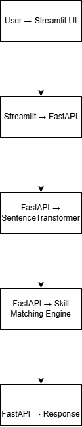

# AI Resume Screening & RAG Evaluation System

A resume-to-job-description evaluation application built with FastAPI and Streamlit. The current deployment uses a lightweight TF-IDF similarity pipeline with explicit skill matching, while the project architecture is designed to support future embedding-based retrieval.

## Live Demo

**Backend API:** https://ai-resume-rag-system.onrender.com

**Frontend:** https://ai-resume-rag-system-b3hq35jwmnsnlzfvtxakta.streamlit.app/

## System Architecture



`Resume PDF → Streamlit → FastAPI → Text Extraction → Cleaning → TF-IDF Vectorization → Cosine Similarity → Skill Matching → Composite Score`

## Project Overview

The application evaluates candidate-job alignment using two complementary signals:

- Semantic similarity between resume and job-description text
- Explicit skill overlap and skill-gap detection

The results are combined into a weighted score and returned through the API for visualization in the frontend.

## Scoring Methodology

### Semantic Similarity

The deployed version uses TF-IDF vectorization and cosine similarity. This keeps memory usage low and makes the application practical for lightweight cloud instances.

### Skill Match

A curated technical keyword set is used to identify matched and missing skills and calculate a skill-alignment percentage.

### Composite Score

`Final Score = (0.7 × Semantic Similarity) + (0.3 × Skill Match)`

The weighting gives more importance to overall textual alignment while still rewarding explicit skill coverage.

## Why TF-IDF?

Transformer embeddings can improve semantic retrieval, but they also increase memory and deployment requirements. TF-IDF provides a lightweight baseline that:

- Reduces memory footprint
- Keeps deployment simple
- Provides interpretable similarity scoring
- Leaves a clear upgrade path to transformer embeddings or a vector database

## Tech Stack

### Backend

- FastAPI
- Scikit-learn
- TF-IDF Vectorizer
- Cosine Similarity
- PDF text extraction
- Uvicorn

### Frontend

- Streamlit
- Plotly visualization

### Deployment

- Render
- Python 3.10

## Example Output

```text
Final Score: 75.87%
Semantic Similarity: 65.53%
Skill Match: 100%

Matched Skills:
python, aws, docker, kubernetes, machine learning
```

## Engineering Highlights

- End-to-end ML application architecture
- REST API design
- PDF upload and text processing
- Similarity and skill-matching logic
- Interactive score visualization
- Cloud deployment under constrained memory

## Future Improvements

- Replace TF-IDF with transformer embeddings such as MiniLM
- Add FAISS or another vector index for retrieval
- Add resume section-level scoring
- Add recruiter analytics
- Introduce a feedback-based evaluation loop
- Add authentication and user accounts
- Expand automated testing and CI/CD
